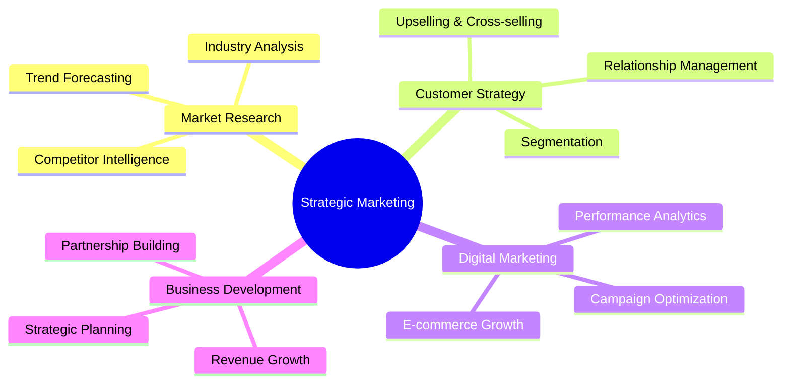

  

  

---

## 🚀 About Me

I'm a **Senior Marketing & Sales Executive** at Samsung SDI, specializing in EV battery market strategies. With a unique blend of technical consulting background and strategic marketing expertise, I drive data-driven growth initiatives.

🔋 **Currently:** Driving EV battery market strategies at **Samsung SDI**  
🎓 **Education:** MBA Candidate at **IIM Kozhikode** (Strategy & Marketing)  
💼 **Background:** Former **SAP Consultant** at Capgemini  
📚 **Author:** "EPIPHANY ECHOES" - Top 120 Amazon Bestseller  
🌍 **Languages:** English, Hindi, Kannada, Malayalam, Japanese (N4)

 

---

## 💼 Professional Journey

| Role | Company | Duration | Key Focus |
|------|---------|----------|-----------|
| 🎯 **Senior Marketing & Sales Executive** | Samsung SDI | Oct 2024 - Present | EV Battery Market Strategy |
| 💻 **SAP Consultant** | Capgemini | Jul 2021 - Oct 2024 | SAP C4C Implementation |
| 🚀 **Startup Founder** | The Glee Project | Jan 2021 - Jul 2021 | E-commerce Gifting Platform |
| 📊 **Product Distribution Coordinator** | Janaki Enterprises | Sep 2020 - Jan 2021 | Market Expansion |
| 👩‍💻 **Software Engineer** | L&T InfoTech | Jul 2016 - Nov 2018 | AML Projects |

---

## 🎯 Core Expertise

---

## 🏆 Key Achievements

| 🎯 **Marketing Excellence** | 📈 **Business Growth** | 🌟 **Recognition** |
|:---:|:---:|:---:|
| ✅ EV battery market leadership | ✅ Founded profitable startup | ✅ Top 120 Amazon Bestseller |
| ✅ Strategic client relationships | ✅ E-commerce platform scaling | ✅ Google Marketing Certified |
| ✅ Data-driven forecasting | ✅ Market expansion success | ✅ SAP Sales Cloud Certified |

---

## 🛠️ Skills & Tools

### 📊 Marketing & Analytics

### 💼 Business Tools

### 🌐 Digital Marketing

---

## 📈 Marketing Portfolio

### 🔋 **EV Market Intelligence**
*Comprehensive analysis of electric vehicle battery market trends, competitor strategies, and growth opportunities*

### 🎯 **Customer Segmentation Studies** 
*Data-driven customer analysis and personalized marketing strategies for B2B clients*

### 📊 **Campaign Performance Analytics**
*ROI optimization frameworks and performance measurement dashboards*

### 🛠️ **Marketing Strategy Templates**
*Reusable frameworks for strategic planning, forecasting, and campaign management*

---

## 🌟 Featured Certifications

🎓 **Google Digital Marketing & E-commerce Professional Certificate**  
🏅 **SAP Certified Application Associate - SAP Sales Cloud 2111**  
📚 **The Fundamentals of Digital Marketing - Google**  
🚀 **Do Your Venture: Entrepreneurship for Everyone - IIM Bengaluru**  
🌏 **First Step Korean - Coursera**

---

## 📬 Let's Connect & Collaborate

 

**Open to:** Strategic Marketing Collaborations | Industry Partnerships | Speaking Opportunities

---

  

  
### 💡 *"Transforming market insights into strategic business growth"* 💡

